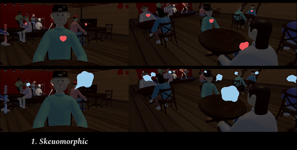
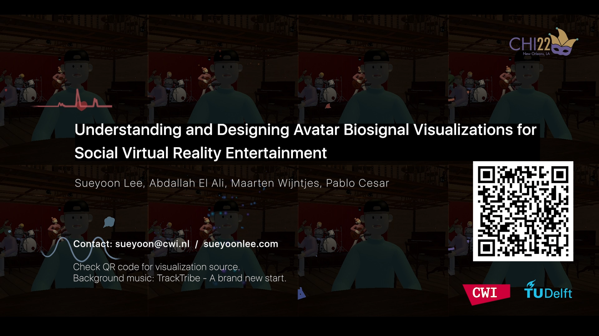

## CHI 2022 paper: Social VR Avatar Biosignal Visualizations

Source code for our CHI 2022 paper:
>* "Understanding and Designing Avatar Biosignal Visualizations for Social Virtual Reality Entertainment"

Repository contains:

* [Avatar Biosignal Visualizations (Heart Rate, Breathing Rate)](source)


Example visualizations:


 is a unity package file that includes biosignal visualizations with an example simulated biosignal. (This file does not include the jazz bar background.)

Follow the instruction to use the file:
1) Open Unity3D with the 'Universal Render Pipeline' template.
2) Import the package to Unity.
3) Read BiosignalManager.cs script to understand how the sample file works.
4) Adjust the BiosignalManager.cs and ExampleBiosignal.csv file if you want to make use of the visualizations for other projects.


## Preprint + Video Preview

Preprint (.pdf) here: [chi2022_socialvr-avatarbiosignals_preprint](preprint/chi22-347.pdf)

30s video preview (soon on YouTube!):

[](https://www.youtube.com "CHI 2022 Social VR Avatar Biosignals")


## Citing this paper or code

**Please cite our paper in any published work that uses any of these resources.**

BiBTeX:
```
@inproceedings{Lee2022,
author = {Lee, Sueyoon and El Ali, Abdallah and Wijntjes, Maarten and Cesar, Pablo},
title = {Understanding and Designing Avatar Biosignal Visualizations for Social Virtual Reality Entertainment},
year = {2022},
isbn = {978-1-4503-9157-3/22/04},
publisher = {Association for Computing Machinery},
address = {New York, NY, USA},
url = {https://doi.org/10.1145/3491102.3517451},
booktitle = {Proceedings of the 2022 CHI Conference on Human Factors in Computing Systems (submitted)},
location = {New Orleans, LA, USA},
series = {CHI '21}
}

  ```

ACM Ref Citation:

*Sueyoon Lee, Abdallah El Ali, Maarten Wijntjes and Pablo Cesar (2022). Understanding and Designing Avatar Biosignal Visualizations for Social Virtual Reality Entertainment. In CHI Conference on Human Factors in Computing Systems (CHI ’22). April 29-May 5, 2022, New Orleans, LA, USA. ACM, New York, NY, USA, 16 pages. https://doi.org/10.1145/3491102.3517451*


## Licenses

Code in this repo is released under [Mozilla Public
License 2.0](https://www.mozilla.org/en-US/MPL/2.0/).
